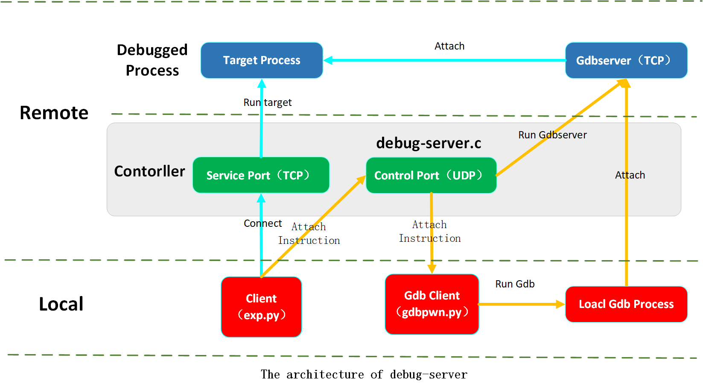

# Debug Server

A customized debug tool designing to automatic attach the target process in either remote or pwntools contexts.



## Requirements

Please install the following package in remote environment.

```shell
apt update
apt install -y gdbserver strace
```

Please install the following package in local environment.

```shell
apt update
apt install -y gdb-multiarch
```

## Usage

1. Add this directory to `$PATH`.
2. Run `gdbinit.py` in your intended workspace to initial environment.
3. Run `debug-server`

    ```shell
    Usage: debug-server [-hmsvn] [-e CMD] [-p PID] [-o CMD]

    General:
      -e CMD   service argv
      -p PID   attach to PID
      -o CMD   get pid by popen
      -h       print help message
      -m       enable multi-service
      -s       halt at entry point
      -v       show debug information
      -n       disable address space randomization
      -u       do not limit memory
    ```

4. Use `gdbpwn.py` to connect to the target IP.
5. Use `exp.py` to connect to the target IP to start the target and send `attach instruction`.

https://github.com/Ex-Origin/debug-server/assets/32574109/af389470-8e71-4432-b6ce-edff9ea65e34

## Features

* Cross-platform
* More automatic
* Streamline the debugging process for reverse engineering (Feature: HALT_AT_ENTRY_POINT)
